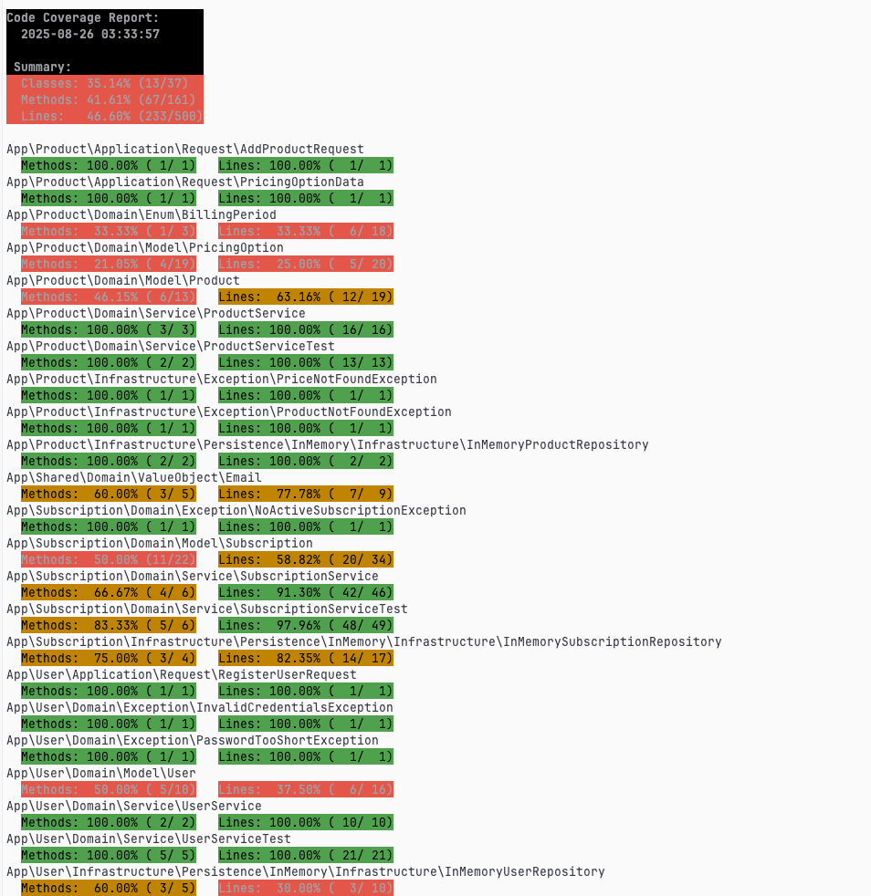

# Take-Home

### https://localhost

## How to:

#### Justfile

1. `just build`
2. `just init-db`
3. `just migrate`

#### Without Justfile

1. `docker-compose build`
2. `docker-compose exec php php bin/console doctrine:database:create`
3. `docker-compose run --rm php bin/console doctrine:migrations:migrate --no-interaction`

#### Tests
`just run-test`
`docker-compose run --rm php bin/phpunit --coverage-html coverage`
`docker-compose run --rm php bin/phpunit --coverage-text`

## API Endpoint

Except `api/register` and `api/login`, all the routes are protected with a JWT token.

| Header          | Value            |
|-----------------|------------------|
| `Authorization` | `Bearer [token]` |

| Method | Endpoint                            | Description                 | Payload                                                                                                                                                                                                                 |
|--------|-------------------------------------|-----------------------------|-------------------------------------------------------------------------------------------------------------------------------------------------------------------------------------------------------------------------|
| POST   | `/api/register`                     | Create a new user           | `{"email": "doe@gmail.com,  "password: "PwdSuperSecure"}`                                                                                                                                                               |
| POST   | `/api/login`                        | Login                       | `{"username": "doe@gmail.com,  "password: "PwdSuperSecure"}`                                                                                                                                                            |
| POST   | `/api/product/add`                  | Add a new product           | `{"name": "PhpStorm", "description": "IDE for PHP by JetBrains", "pricingOption": [ {"name": "Monthly", "price": 29.99, "billingPeriod": "monthly"},  {"name": "Yearly", "price": 299.99, "billingPeriod": "yearly"}]}` |
| POST   | `/api/subscription/subscribe`       | Subscribe user to a product | `{"productName": "PhpStorm","pricingOptionName": "Monthly"} `                                                                                                                                                           |
| DELETE | `/api/subscription/cancel`          | Cancel subscription         | `{"productName": "PhpStorm"}`                                                                                                                                                                                           |
| GET    | `/api/users/subscription/subscribe` | List active subscriptions   | `N\A`                                                                                                                                                                                                                   |

## Context:

The system should be able to:

- Add users and products
- Subscribe a user to a product
- Cancel a subscription
- List all active subscriptions for a given user

```
src/
├── Product/
│   ├── Application/
│   │   ├── Controller/
│   │   └── Request/
│   ├── Domain/
│   │   ├── Enum/
│   │   ├── Model/
│   │   ├── Repository/
│   │   └── Service/
│   └── Infrastructure/
│       ├── Exception/
│       └── Persistence/
│           └── Doctrine/
│               ├── Mapping
│               ├── Repository
│               └── Type
├── Shared/
│   ├── Domain/
│   │   └── ValueObject/
│   └── Infrastructure/
│       └── Persistence/
│           ├── Doctrine/
│           │   ├── Migrations
│           │   └── Type
│           ├── InMemory/
│           └── Security
├── Subscription/
│   ├── Application/
│   │   ├── Controller/
│   │   └── Request/
│   ├── Domain/
│   │   ├── Exception/
│   │   ├── Model/
│   │   ├── Repository/
│   │   └── Service/
│   └── Infrastructure/
│       └── Persistence/
│           └── Doctrine/
│               ├── Mapping
│               └── Repository
├── User/
│   ├── Application/
│   │   ├── Request/
│   │   └── Controller/
│   ├── Domain/
│   │   ├── Model/
│   │   ├── Repository/
│   │   └── Service/
│   └── Infrastructure/
│       └── Persistence/
│        │  └── Doctrine/
│        │  │   ├── Mapping
│        │  │   └── Migrations
│        └── Security
```

`just run-test`
or
`docker-compose run --rm php bin/phpunit --coverage-html coverage`

